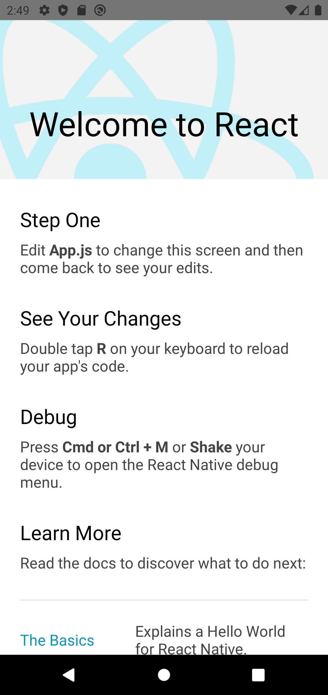
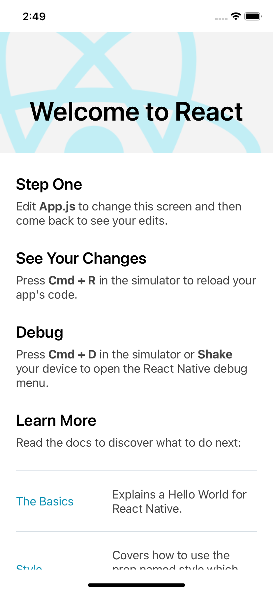
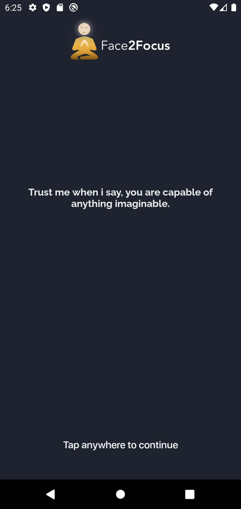
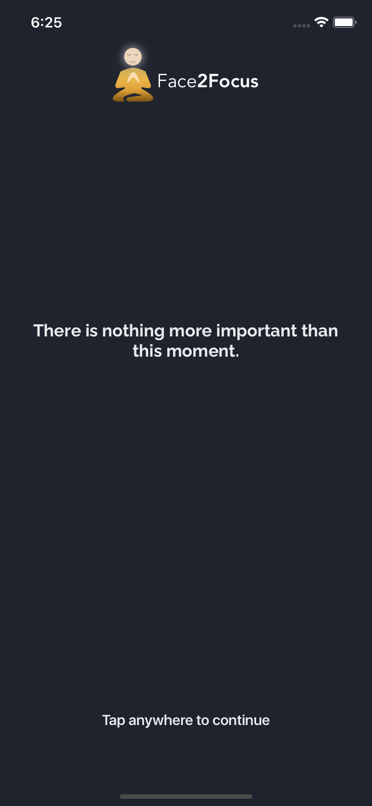
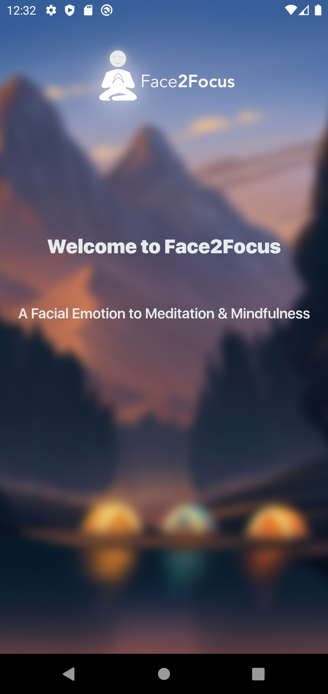
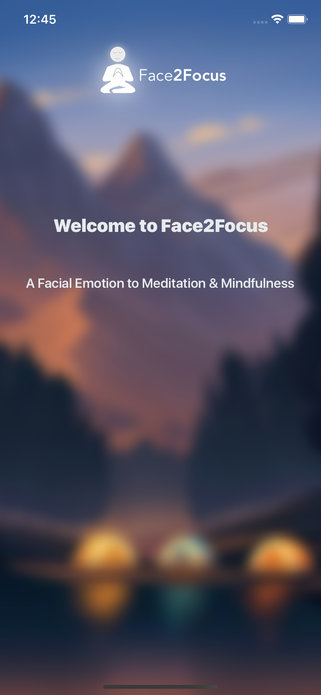
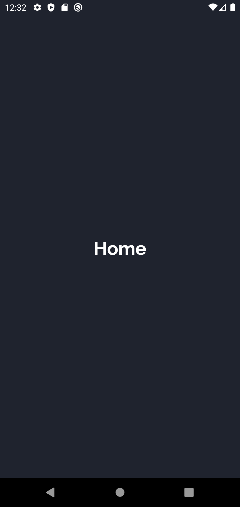

# face-2-focus-ios-android GuideLine to Project Journey

## Introduction to the Face2Focus - Using Facial Expression Recognition to Meditate

Facial Emotion Recognition ( FER ) to meditation Suggestion Cross-Platform Mobile Application using React-Native for UI, Google Firebase for Storage, and AWS for Image Analysis 😃😃😇

## Main Aim and Objective

This Project is for learning and Third year project development purpose. Mainly using the leatest technology to build the next generation cross Platform mobile application using React Native technoloyg created by facebook community.☺️

## Technology Aim to use in this project

1. React Native - Cross-Platform mobile application development technology used to create both android as well ios application using some Javascript, ES6, JSX concepts.
2. AWS - Amazon Web Services are emergying very fast all orgnation today was going to serverless application. now many starup company are already using AWS and other cloud computing platform like azure, digital Ocean, Google Cloud and Many more are there.

- in this project i am going to use some AWS service main to image analysis there is speacial service provided by amazon i.e. Amazon Rekognition
- S3 is used to store image of user
- Lambda is used to process image to Amazon Rekognition
- any many more will going to use in this project. 🙂

3. Google Firebase - To store media like audio and some more infomation of users.

### Setting Project Environment for React Native ( Link are Provided for References)

TypeScript - https://www.typescriptlang.org

React-Native with TypeScript - https://reactnative.dev/docs/typescript#getting-started-with-typescript

### Initial Look up of React Native Application - cryptocurrency

Images source - Screen Shots

# android

# iOS

## Quotation Screen

Here every time when application is loaded or Open the spiritual quotation will be change and heal your mind with positive energy.
# android

# iOS

## Splash Screen for Ios
Reference - https://www.youtube.com/watch?v=H0CC1UsvjDQ&t=149s
To make splash screen make sure you are aware about the some native component of ios native development like some shift.
Official - https://www.npmjs.com/package/react-native-splash-screen

## Splash Screen for Android
Android native concept clear before making splash into android Studio 
some React native specific thing require to put into native environment
Reference - https://www.youtube.com/watch?v=yFrx8HZlNtI

## Login Screen 
Using Button user will log in and log out by using google firebase
*** Functionality Remain *** 

### Android

### iOS

## Home Tentative Screen View
Home Screen will show us the how much minites you have been meditate ### Android

### iOS

